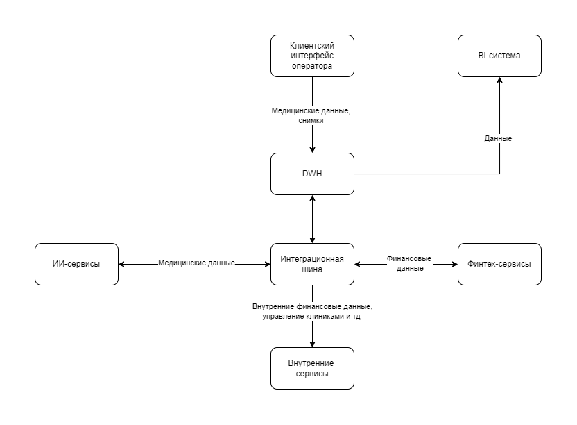

# ADR-1: Архитектурная трансформация компании "Будущее 2.0" (годовой план)
## Общая информация
- **Статус**: Предложение (Draft)
- **Категория**: Планирование
- **Автор**: Полина
- **Дата**: 15.09.25

## Контекст
Компания "Будущее 2.0" вышла за рамки медицинского стартапа и превратилась в холдинг с клиниками, ИИ- и финтех-сервисами, а также планами по интеграции новых бизнесов. Исторический монолитный DWH на SQL Server перестал справляться: генерация отчетов занимает много времени, интеграция новых направлений требует сложных доработок. Новые требования к производительности мотивируют бизнес пересмотреть архитектуру с позиций масштабируемости и удобства для новых интеграций. Например, есть необходимость внедрения витрины данных для независимого самообслуживания различных доменов бизнеса.

## Текущая архитектура

### Организационная структура
- Головной офис
- Клиники
- ИИ-сервисы для работы с медицинскими данными в виде отдельной компании
- Финтех-сервисы в виде отдельной компании с банковской лицензией
- Дополнительно: в ближайшее время добавятся фармацевтика и производство техники

### Текущие продукты и сервисы
- Финтех-сервисы
- Внутренняя медицинская система-DWH с клиентским интерфейсом и дополнительной бизнес-логикой под финтех- и ИИ-сервисы
- Кастомные решения BI-системы поверх DWH
- ИИ-сервисы для работы с медицинскими данными
- Слой интеграций через старую шину данных

### Технологии
- DWH на базе Microsoft SQL-сервера 2008 года
- Power BI
- Power Builder
- Шина на базе Apache Camel
- ИИ-сервисы на Python
- Финтех-сервисы на Golang и Java

### Описание текущих потоков данных. DFD-диаграмма.

## Описание проблемных мест в текущей архитектуре бизнеса

В таблице представлена оценка проблемных архитектурных мест, а также определение приоритетов по методологии MoSCoW (Must have, Should have, Could have, Won’t have)

|Секция MoSCoW|Проблема|Риск для бизнеса|Техническое обоснование|
|---|---|---|---|
|**M (Must have). Критично важно**|Монолит DWH на SQL Server 2008|Монолит усложнет интеграцию новых бизнес-доменов. Долгий TTM| Монолитная архитектура, устаревшая технология. Любое изменение может непредсказуемо задеть весь ETL, удорожание разработки при внедрении новой бизнес-логики|
||Медленное формирование отчетов в BI-аналитике|Снижение оперативности принятия решений, неудовлетворенность пользователей, риск получения неактуальных данных|Большие объемы (размеры в ТБ), сложные преобразования отчетности внутри монолитного DWH замедляют производительность. Нет разгрузки в сторону витрин.|
||Отсутствие масштабируемой витрины данных|Для клиентской стороны не предусмотрено самостоятельное создание отчетности|Нет единого инструмента для быстрого доступа к данным разных доменов, нет возможности самостоятельно заниматься кастомизацией отчетности. BI-слой перегружен кастомизациями "под капотом"|
|**S (Should have). Важно**| Зависимость от легаси-систем (Power Builder, SQL Server 2008) |Рост стоимости сопровождения, дефицит специалистов|Устаревшие технологии плохо поддерживаются, ограничены возможности интеграции. Есть проблемы с масштабируемостью, отказоусточивостью при росте нагрузки. Могут возникнуть проблемы с безопасностью, если поддержка продукта прекратится|
||Ограниченная интеграционная шина (Apache Camel)|Сложность подключения новых сервисов и бизнес-единиц|Нет гибкой поддержки современных протоколов и событийной архитектуры. При потоковой обработке шина может не справиться с наплывом данных (объемы данных уже измеряются в ТБ)|
||Отсутствие явного Data Governance|Потенциальные риски утечки данных, нарушения ФЗ 152|Сейчас нет явных политик по управлению данными, доступами к конфиденциальной информации. Необходимо обеспечить ролевую, доменную изоляцию, т.к. все данные находятся в одном месте с одинаковым доступом к ним|
|**C (Could have). Желательно**|Единая справочная информация по всем источникам данных| Увеличивается срок поиска, анализа и обработки данных разных доменов для аналитических работ. Есть риск дубликации данных в разных доменах|Данные разрознены, требуется единый сбор, ведение справочной информации о данных и их источниках|
|**W (Won’t have for now). Пока не делаем** |-|-|-|

# Архитектура компании через год